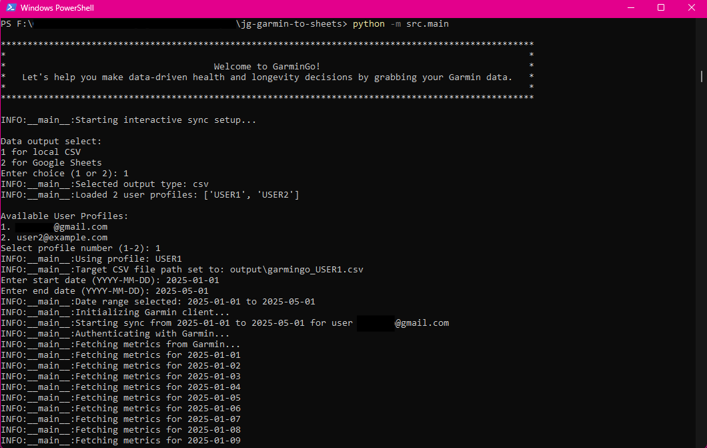
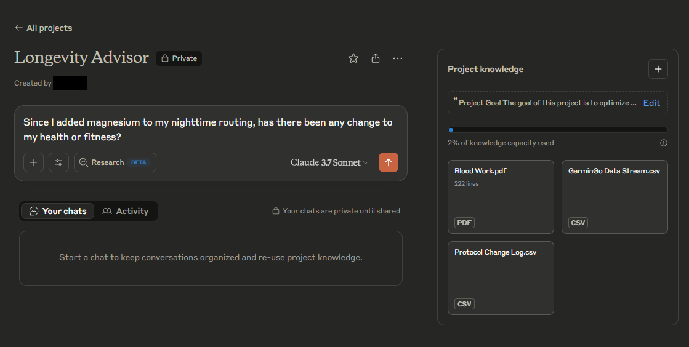
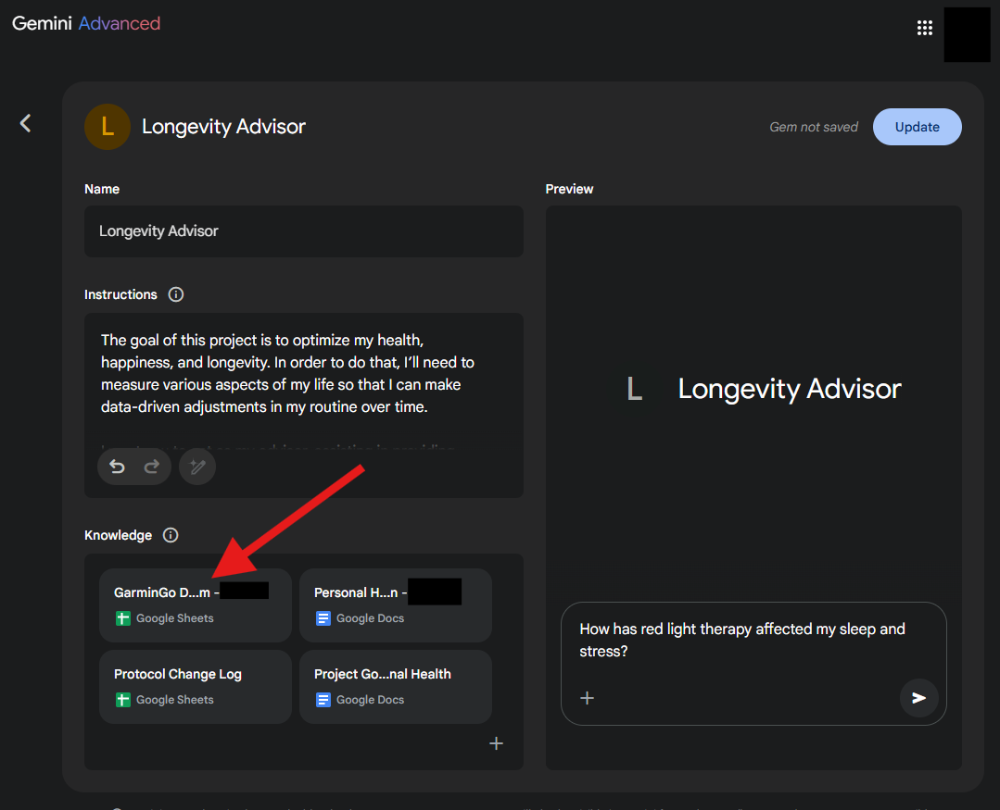

# 🚀 GarminGo: Make data-driven decisions about your health, fitness, and longevity! 📄📈

Pull your daily health metrics from Garmin Connect and save them directly to a user-friendly CSV file or Google Sheets.

I created this utility to feed my data into AI (e.g. LLMs like Claude, ChatGPT, and Gemini) so that I could gain insights for improving my health and longevity. 

Even if you aren't technical, getting your data as a CSV is pretty simple!

While it's simple for non-technical users, it also supports power users, allowing you to schedule and run everything via command line arguments.

**🔒 Security & Privacy First:**

*   **Open Source:** GarminGo's code is simple and viewable by anyone.
*   **Local Credentials:** Your Garmin login details are stored securely on *your* computer in the `.env` file (which you create).
*   **Google Integration (Optional):** If using Google Sheets, the app securely links your Google account via your browser the first time you run it for Sheets output.

✨ Pro tip!

If feeding your data to an LLM (like Claude, ChatGPT, or Gemini), ensure you are on a paid plan and that you check the privacy settings. Paid Claude accounts are "private by default" making Claude an excellent option. 

Power users can also consider running local LLMs.

## Table of Contents

* [✨ Screenshots](#screenshots)
* [🚀 Quick Start: Get Your Data as a CSV File](#quick-start-get-your-data-as-a-csv-file)
* [⚙️ Advanced Options & Google Sheets Integration](#advanced-options--google-sheets-integration)
    * [Optional: Use a Python Virtual Environment](#optional-use-a-python-virtual-environment)
    * [Optional: Running as a Scheduled Task](#optional-running-as-a-scheduled-task)
    * [🔑 Google API Setup (for Google Sheets Output)](#google-api-setup-for-google-sheets-output)
    * [▶️ Running for Google Sheets Output:](#running-for-google-sheets-output)
* [📊 Available Metrics](#available-metrics)
* [🛠️ Troubleshooting](#troubleshooting)
* [🔒 Security Notes](#security-notes)
* [📜 License](#license)

## ✨ Screenshots

**Running the App:**

*A simple interactive menu guides you.*

**Google Sheets Output (can also be to local CSV):**

*Your Garmin data ready for analysis or AI.*

**Health and Longevity Insights in Claude:**

*Your Garmin data ready for analysis or AI in Claude, ChatGPT, or Gemini.*

**Live Googe Sheets Connection to Gemini:**

*Live connection between Google Sheets and Gemini.*

---

## 🚀 Quick Start: Get Your Data as a CSV File

This is the easiest way to get started and export your Garmin data.

**1. 🐍 Install Python:**
   *   Make sure you have Python 3.9 or newer installed. You can download it from [python.org](https://www.python.org/downloads/).

**2. 📄 Get the Code:**
   *   Go to the GarminGo GitHub repository page (you are probably already there).
   *   Click the green "Code" button at the top right of the page) and select **"Download ZIP"**.
   *   Extract the downloaded ZIP file to a folder on your computer (e.g., `C:\GarminGo` or `/Users/YourName/GarminGo`).
   *   *(Advanced users can clone the repository using `git clone ...` if preferred).*

**3. ✨ Install Dependencies:**
   *   **Open PowerShell or Command Prompt (CMD) in the Project Folder:**
       1.  Open File Explorer and navigate to the folder where you extracted the downloaded ZIP file (e.g., `jg-garmin-to-sheets-main`).
       2.  Click in the address bar at the top of File Explorer.
       3.  Type `powershell` and press Enter. (Alternatively, type `cmd` and press Enter).
       *   This opens a terminal window directly in your project folder. You should see the folder path in the prompt (e.g., `PS C:\path\to\jg-garmin-to-sheets-main>`).
   *   *(Alternatively, open PowerShell/CMD from the Start Menu and use the `cd` command to navigate: `cd path\to\your\jg-garmin-to-sheets-main`)*
   *   In the PowerShell or CMD window you just opened, run the following command to install the necessary libraries):
     ```sh
      pip install -r requirements.txt
     ```

**4. ⚙️ Configure Your Garmin Login:**
   *   In the project folder, find the file named `.env.example`.
   *   **Make a copy** of this file and **rename the copy** to just `.env`.
   *   Open the `.env` file with a text editor (like Notepad or VS Code).
   *   Find the lines starting with `USER1_` and fill in *only* your Garmin Connect email and password:
     	 ```dotenv
      	# User Profile 1
      	USER1_GARMIN_EMAIL=your_garmin_email@example.com # <-- Put your email here
      	USER1_GARMIN_PASSWORD=your_garmin_password     # <-- Put your password here
      	USER1_SHEET_ID= # <-- Leave this blank for CSV output
      	```

   *   Save the `.env` file. (You can add more `USER<N>_` profiles later if needed).

**5. ▶️ Run the App & Get CSV:**
   *   Make sure you are still in the project directory in your PowerShell or CMD window.
   *   Run the application using this command:

     	```powershell
      	python -m src.main
      	```

   *   The interactive menu will appear:
       1.  **Choose Output:** Select `1` for `CSV`.
       2.  **Select Profile:** Choose the user profile you configured (e.g., `USER1`).
       3.  **Enter Dates:** Input the start and end dates using the `YYYY-MM-DD` format (e.g., `2024-01-01`).
   *   The app will fetch your data.

**6. 📁 Get Your Data!**
   *   Success! Your data is saved as a CSV file named `garmingo_<profile_name>.csv` (e.g., `garmingo_USER1.csv`) inside the `output` folder within the project directory.
   *   This `output` folder should automatically open in your file explorer, showing you the file.

**7. Optional: Prep Your AI!**

   *   As shown in the screenshots above, once you have your data, you can connect it to the AI of your choice.
   *   Describe in full detail what YOU want help with. 
   *   Give the LLM a clear role.
   *   Add as much documentation as you are comfortable with. This can be GarminGo data, a log of your protocol changes, doctor notes, blood work, and more.

**Sample Instructions:**

> **Project Goal**
> 
> The goal of this project is to optimize my health, happiness, and longevity. In order to do that, I need to measure various aspects of my life and make data-driven adjustments in my routine over time.
> 
> I want you to act as my advisor, assisting in providing research-based recommendations and facts that will aid in my decision-making processes. You will effectively be my "Longevity Advisor" layering in expertise from the nutrition, fitness, and medical fields. I understand I need to make any final decisions myself and with a medical professional, but you can still provide me with information to help guide my decision making and sharpen the questions I ask.
> 
> In the Knowledge, you will find these documents:
> (list documents with a description)
> 
> I want you to act as my partner and consultant in this journey, helping me brainstorm and objectively look at progress and areas of opportunity.
> 
> Look for changes and ideas that will make the most impact with the least effort and expense. That said, if there are high-value, high-probability changes I can make that will require effort or cost, it is okay to recommend them too. Just ensure changes are prioritized. The 80/20 rule and Pareto chart concepts will likely apply here.


## ⚙️ Advanced Options & Google Sheets Integration

This section is for users who want to output data directly to Google Sheets or use Python virtual environments.

**Optional: Use a Python Virtual Environment**

For cleaner dependency management, you might want to create a virtual environment *before* installing requirements (Step 3 in Quick Start).

1.  Navigate to the project directory.
2.  Create: `python -m venv venv`
3.  Activate:
    *   Windows: `venv\Scripts\activate`
    *   macOS/Linux: `source venv/bin/activate`
4.  Then run `pip install -r requirements.txt` as usual. Remember to activate the environment (`venv`) each time you run the app.

### Optional: Running as a Scheduled Task

For users who wish to run GarminGo non-interactively, for example, as a scheduled task, command-line arguments can be used. This allows you to specify the start date, end date, user profile, and output type directly.

Use the following command structure:
```bash
python -m src.main cli-sync --start-date YYYY-MM-DD --end-date YYYY-MM-DD --profile YOUR_PROFILE_NAME --output-type <csv_or_sheets>
```
Replace `YYYY-MM-DD` with the desired dates, `YOUR_PROFILE_NAME` with your configured profile name (e.g., `USER1` if you followed the basic setup), and `<csv_or_sheets>` with either `csv` or `sheets` depending on your desired output.

### 🔑 Google API Setup (for Google Sheets Output)

To send data to Google Sheets, you need to set up Google API credentials.

1.  **Google Cloud Console:**
    *   Go to the [Google Cloud Console](https://console.cloud.google.com/).
    *   Create a new project or select an existing one.
    *   Enable the **Google Sheets API** for your project.
2.  **Create OAuth Credentials:**
    *   Go to "APIs & Services" > "Credentials".
    *   Click "+ CREATE CREDENTIALS" > "OAuth client ID".
    *   Select "Desktop app" as the application type. Give it a name (e.g., "GarminGo Client").
    *   Click "Create". You'll see a Client ID and Client Secret (you don't need to copy these now).
    *   Click **"DOWNLOAD JSON"** on the right side of the newly created credential.
3.  **Save Credentials File:**
    *   Create a folder named `credentials` inside your main GarminGo project folder.
    *   Move the downloaded JSON file into this `credentials` folder.
    *   **Rename** the downloaded file to `client_secret.json`.
4.  **Configure `.env` for Google:**
    *   Open your `.env` file.
    *   Ensure the `GOOGLE_CLIENT_SECRET_PATH` points to your file:
     ```dotenv
     GOOGLE_CLIENT_SECRET_PATH=credentials/client_secret.json
     ```
    *   The `GOOGLE_TOKEN_PATH` is where the app will store your authorization token once you grant access. The default is usually fine:
     ```dotenv
     GOOGLE_TOKEN_PATH=credentials/token.pickle
     ```
    *   For *each user profile* you want to sync to Sheets, you **must** provide a `USER<N>_SHEET_ID`:
        *   Create a Google Sheet for the data.
        *   The Sheet ID is in the URL: `https://docs.google.com/spreadsheets/d/[THIS-IS-THE-SHEET-ID]/edit`
        *   Copy this ID into the corresponding `USER<N>_SHEET_ID` field in your `.env` file:
          ```dotenv
          USER1_GARMIN_EMAIL=user1@example.com
          USER1_GARMIN_PASSWORD=password1
          USER1_SHEET_ID=the_actual_sheet_id_from_google # <-- Add Sheet ID here
          ```
    *   Save the `.env` file.

### ▶️ Running for Google Sheets Output:

1.  Make sure your `.env` file is configured with the Sheet ID(s) and Google credential paths.
2.  Activate your virtual environment if you are using one.
3.  Run the app from the project directory:
    ```powershell
    python -m src.main
    ```
4.  Follow the interactive menu:
    1.  **Choose Output:** Select `2` for `Google Sheets`.
    2.  **Select Profile:** Choose the user profile (ensure it has a `SHEET_ID` in `.env`).
    3.  **Enter Dates:** Input start and end dates (`YYYY-MM-DD`).
5.  **❗First Run Only:** Your web browser will open, asking you to log in to your Google account and grant permission for the app to access your Google Sheets. Allow access. A `token.pickle` file will be created in your `credentials` folder.
6.  The app will then fetch the data and write it to the specified Google Sheet.

---

## 📊 Available Metrics

The tool syncs the following daily metrics from Garmin Connect:

*   Sleep Score
*   Sleep Length
*   Weight
*   Body Fat Percentage
*   Blood Pressure (Systolic/Diastolic)
*   Active/Resting Calories
*   Resting Heart Rate
*   Average Stress
*   Training Status
*   VO2 Max (Running/Cycling)
*   Intensity Minutes
*   Activity Counts and Distances/Durations (Running, Cycling, Strength, Cardio)

*These metrics were chosen specifically because they relate to long-term health and longevity planning.*

Want a metric added? Just raise an Issue and request it!

---

## 🛠️ Troubleshooting

*   **Garmin Login Issues:** Double-check `USER<N>_GARMIN_EMAIL` and `USER<N>_GARMIN_PASSWORD` in your `.env` file.
*   **Google Sheets Access Denied / Errors:**
    *   Ensure the Google Sheets API is enabled in your Google Cloud project.
    *   Verify the `USER<N>_SHEET_ID` in `.env` is correct and that the Google account you authorized has edit access to that specific Sheet.
    *   Try deleting the `credentials/token.pickle` file and running the app again (choose Sheets output). This forces re-authentication via your browser.
*   **`FileNotFoundError` for `.env` or `client_secret.json`:** Make sure you are running the `python -m src.main` command from the *main project directory* (the one containing `src`, `requirements.txt`, etc.) and that the files exist in the correct locations (`.env` in the root, `client_secret.json` inside the `credentials` folder).
*   **Module Not Found Errors:** Ensure you have installed dependencies (`pip install -r requirements.txt`) and activated your virtual environment if you created one.

---

## 🔒 Security Notes

*   **Never share or commit your `.env` file** to Git or any public place, as it contains your passwords.
*   The `.gitignore` file is already set up to prevent accidental commits of `.env` and the `credentials` folder.
*   Keep your Google `client_secret.json` file secure.

---

## 📜 License

This project is licensed under the MIT License - see the [LICENSE.md](LICENSE.md) file for details.