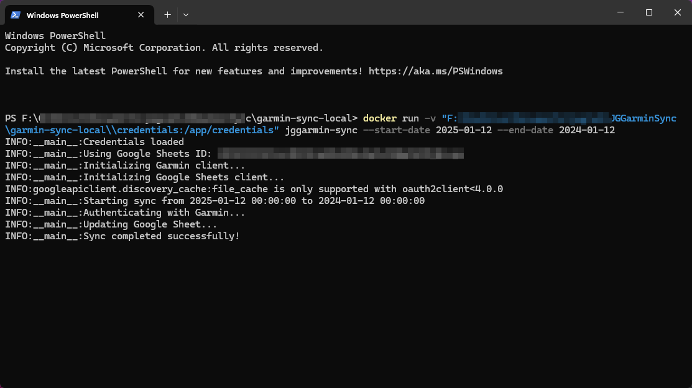
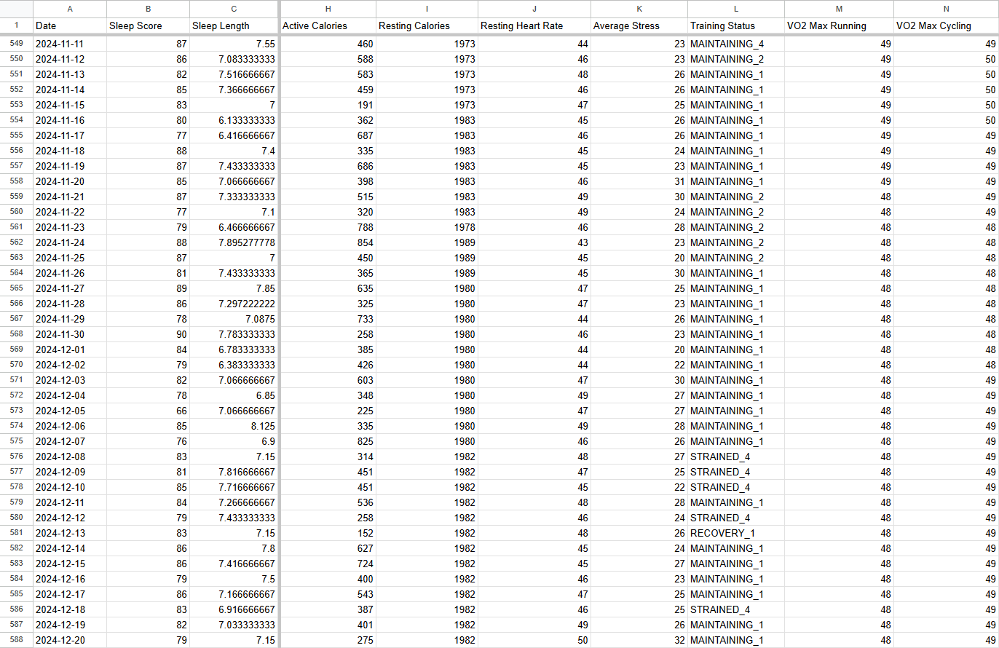

# Garmin Data to Google Sheets Utility

A command-line tool that pulls daily health metrics from Garmin Connect and stores them in Google Sheets.

I created this utility to feed data into an LLM (e.g. Claude, ChatGPT, or Gemini) so that I could gain insights for improving my health and longevity.

You can run it with either Python installed or as a Docker container.

- Securely store your credentials in the .env file.
- When you first run the application, it will launch your browser, allowing you to link your Google account to connect to Sheets.

## Screenshots

Running the utility in PowerShell:

*Simple command line utility to pull daily data from Garmin and store it in a Google Sheet.*

The result:

*Your Garmin data is now in a Google Sheet ready for additional analysis.*

## Prerequisites

- Docker installed on your system -or- Python 3.9 or higher
- A Garmin Connect account
- A Google account with access to Google Sheets

## Setup Instructions

### 1. Clone the Repository
```bash
git clone https://github.com/yourusername/garmin-sync.git
cd garmin-sync
```

### 2. Set Up Google Sheets API

1. Go to the [Google Cloud Console](https://console.cloud.google.com/)
2. Create a new project or select an existing one
3. Enable the Google Sheets API for your project
4. Create credentials (OAuth 2.0 Client ID):
   - Click "Create Credentials" > "OAuth client ID"
   - Choose "Desktop app" as the application type
   - Download the client configuration file
5. Create a new directory called `credentials` in the project root
6. Move the downloaded file into the `credentials` directory and rename it to `client_secret.json`

### 3. Configure Environment Variables

1.  **Copy the Example File:** Create a `.env` file by copying the example:
    ```bash
    cp .env.example .env
    ```

2.  **Edit `.env`:** Open the `.env` file and populate it with the details for each user profile you want to sync. Follow the `USER<N>_` prefix convention shown in `.env.example`:

    ```dotenv
    # User Profile 1
    USER1_GARMIN_EMAIL=user1@example.com
    USER1_GARMIN_PASSWORD=password1
    USER1_SHEET_ID=sheet_id_1

    # User Profile 2
    USER2_GARMIN_EMAIL=user2@example.com
    USER2_GARMIN_PASSWORD=password2
    USER2_SHEET_ID=sheet_id_2
    # Add more users as needed following the USER<N>_ prefix pattern

    # Google API Credentials (shared, point to your downloaded files)
    GOOGLE_CLIENT_SECRET_PATH=credentials/client_secret.json
    GOOGLE_TOKEN_PATH=credentials/token.pickle
    ```

    *   Replace the example emails, passwords, and sheet IDs with your actual Garmin Connect credentials and the Google Sheet ID for *each user*.
    *   The `GOOGLE_CLIENT_SECRET_PATH` and `GOOGLE_TOKEN_PATH` usually don't need changing if you followed Step 2 (Google Sheets API Setup).

3.  **Get Google Sheet IDs:** For each user's sheet:
    *   Create a new Google Sheet or use an existing one.
    *   The Sheet ID is part of the URL: `https://docs.google.com/spreadsheets/d/[THIS-IS-YOUR-SHEET-ID]/edit`
    *   Copy this ID into the corresponding `USER<N>_SHEET_ID` field in your `.env` file.

### 4. Build and Run with Docker

1. Build the Docker image:
```bash
docker build -t garmin-sync .
```

2.  **Run the Sync Tool:**
    ```bash
    # Make sure your .env file is in the current directory
    # Mount the credentials directory and the .env file
    docker run -v $(pwd)/credentials:/app/credentials -v $(pwd)/.env:/app/.env garmin-sync
    ```
    The tool will now run interactively:
    *   It will list the user profiles found in your `.env` file and prompt you to select one.
    *   It will then ask for the `Start Date` (YYYY-MM-DD format).
    *   Finally, it will ask for the `End Date` (YYYY-MM-DD format).

    The data for the selected user and date range will be synced to their specified Google Sheet.

### Running Without Docker

If you prefer to not use Docker, you can run directly with Python.

1. Create a virtual environment:
```bash
python -m venv venv
source venv/bin/activate  # On Windows: venv\Scripts\activate
```

2. Install dependencies:
```bash
pip install -r requirements.txt
```

3.  **Run the Sync Tool:**
    ```bash
    # Make sure your .env file is in the project root directory
    python -m src.main
    ```
    The tool will now run interactively:
    *   It will list the user profiles found in your `.env` file and prompt you to select one.
    *   It will then ask for the `Start Date` (YYYY-MM-DD format).
    *   Finally, it will ask for the `End Date` (YYYY-MM-DD format).

    The data for the selected user and date range will be synced to their specified Google Sheet.

## Available Metrics

The tool syncs the following daily metrics from Garmin Connect:
- Sleep Score
- Sleep Length
- Weight
- Body Fat Percentage
- Blood Pressure (Systolic/Diastolic)
- Active/Resting Calories
- Resting Heart Rate
- Average Stress
- Training Status
- VO2 Max (Running/Cycling)
- Intensity Minutes
- Activity Counts and Distances/Durations (Running, Cycling, Strength, Cardio)

These metrics were chosen specifically because they relate to long-term health and longevity planning.

## Troubleshooting

1. Authentication Issues:
   - Ensure your Garmin credentials are correct in `.env`
   - For Google Sheets connection issues, delete `token.pickle` and try again. This will trigger the app to launch your browser and reconnect your Google account.

2. Permission Issues:
   - Ensure the credentials directory is mounted correctly in Docker
   - Check that your Google account has edit access to the sheet

## Security Notes

- Never commit your `.env` file or anything in the `credentials` directory
- Keep your Google client secret and credentials secure
- The tool uses environment variables for all sensitive data

## License

This project is licensed under the MIT License - see the [LICENSE.md](LICENSE.md) file for details.
